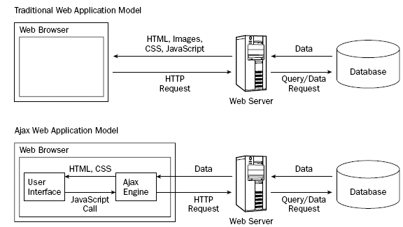

# AJAX 
AJAX significa 'Asynchronous JavaScript And XML'. En pocas palabras, es el uso
del objeto XMLHttpRequest para comunicarse con los servidores.

Puede enviar y recibir informacion en varias formatos, incluidos JSON,
XML, HTML y archivos de texto.

El atractivo de AJAX es su naturaleza 'asincrona', lo que significa que
puede comunicarse con el servidor, intercambiar datos y actualizar la pagina
sin tener que recargar el navegador.

* Metodos Nativos
  - ActiveXObject (IE8 e inferiors, esta depreciado)
  - XMLHttpRequest
  - API Fetch

* Librerias Externas
  - jQuery.ajax()
  - Axios
  - etc.

AJAX no es una tecnologia en si mismo. En realidad, se trata de varias
tecnologias independientes que se unen:
  - HTML y CSS, para crear una presentacion basada en estandares.
  - DOM, para la interacion y manipulacion dinamica de la presentacion.
  - HTML, XML y JSON, para le intercambio y manipulacion de informacion.
  - XMLHttpsRequest o Fetch, para le intercambio asincrono de informacion.
  - JavaScript, para unir todas las demas tecnologias.

Es importante tambien considerar los 'codigos de estado de respuesta HTTP'
y los estados de la peticion AJAX:
  
  Estado    READY_STATE_UNINITIALIZED
  Valor     0
  
  Estado    READY_STATE_LOADING
  Valor     1
  
  Estado    READY_STATE_LOADED
  Valor     2
  
  Estado    READY_STATE_INTERACTIVE
  Valor     3
  
  Estado    READY_STATE_COMPLETE
  Valor     4

* Objeto XMLHttpRequest
  
  const xhr = new XMLHttpRequest(),
  $xhr = document.getElementById('xhr'),
  $fragment = document.createDocumentFragment()

  xhr.addEventListener('readystatechange', e => {
    if (xhr.readyState !==4) return
    console.log(xhr)
    if(xhr.status >= 200 && xhr.status < 300) {
      console.log('exito')
      console.log(xhr.responseText)
      // $xhr.innerHTML = xhr.responseText
      let json = JSON.parse(xhr.responseText)
      console.log(json)
      json.forEach(el => {
        const $li = document.createElement('li')
        $li.innerHTML = `${el.name} -- ${el.email} -- ${el.phone}`
        $fragment.appendChild($li)
      })
      $xhr.appendChild($fragment)
    } else {
      console.log('error')
      let message = xhr.statusText || 'ocurrio un Error'
      $xhr.innerHTML = `error ${xhr.status}: ${message}`
    }
    console.log('este mensage cargara de cualquier forma')
  })

  xhr.open('GET', 'https://jsonplaceholder.typicode.com/users')
  // xhr.open('GET', 'assets/users.json')
  xhr.send()
---

* API Fetch

  const $fetch = document.getElementbyId('fetch)  ,
  $fragment = document.createDocumentFragment()

  // fetch('assets/users.json')
  fetch('https://jsonplaceholder.typicode.com/users')
    /* .then( response => {
      console.log(response)
      return response.ok ? response.json() : Promise.reject(response)
    }) */
    .then( res => (res.ok ? res.json() : Promise.reject(res)))
    .then( json =>{
      console.log(json)
      // $fetch.innerHTML = json
      json.forEach( el => {
        const $li =  document.createelement('li')
        $li.innerHTML = `${el.name} -- ${el.email} -- ${el.phone}`
        $fragment.appendChild($li)
      })
      $fetch.appendChild($fragment)
    })
    .catch( err => {
      console.log(err)
      let message = err.statusText || 'Ocurrio un erro'
      $fetch.innerHTML = `Error ${err.status}: ${message}`
    })
    .finally( () => console.log('esto se ejecutara independiente del resultado de la Promesa Fetch') )
---

* API Fetch + (Async - Await)

  const fecthAsync = document.getElementById('fecth-async'),
        fragment = document.createDocumnetFragment()
  async function getData() {
    try {
      let res = await fecth('https://jsonplaceholder.typicode.com/users'),
          json = await res.jon()
      console.log(res, json)
      // if(!res.ok) throw new Error('Ocurrio un Error al solicitar los datos')
      if(!res.ok) throw { status: res.status, statusText: res.statusText}
      json.forEach( el => {
        const li = document.createElement('li')
        li.innerHTML = `${el.name} ${el.email} ${el.phone}`
        fragment.appnedChild(li)
      })
      fetchAsync.appendChild(fragment)
    } catch (err) {
      console.log(err)
      let messahe.innerHTML = `Error ${err.status}: ${message}`
    } finally { console.log('Esta lina se ejecutara independientemente del try...catch)}
  }
  getData()
---

* Libreria Axios

  const axios = document.getElementById('axios'),
        fragment = document.createdocumentfragment()

  axios
    // .get('assets/users.json')
    .get('https://jsonplaceholder.typicode.com/users')
    .then( res => {
      console.log(res)
      let json = res.data
      json.forEach( el => {
        const li = document.createElement('li')
        li.innerHTML = `${el.name} -- ${el.email} -- ${el.phone}`
        fragment.appendChild(li)
      })
      axios.appendChild(fragment)
    })
    .catch ( err => {
      console.log(err.response)
      let message = err.response.statusText|| 'Ocurrio un error'
      axios.innerHTML = `Error ${err.response.status}: ${message}`
    })
    .finally ( () => console.log('esta linea se ejecutara independientemente del resultado de Axios') )
---

* Libreria Axios + (Async - Await)

  const axiosAsync = document.getElementById('axios-async'),
        fragment = document.createDocumentFragment()
  async function getData() {
    try {
      let res = await axios.get('https://jsonplaceholder.typicode.com/users'),
          json = await res.data
      console.log(res, json)
      json.forEach( el => {
        const li = document.createElement('li')
        li.innerHTML = `${el.name} -- ${el.email} -- ${el.phone}`
        fragment.appendChild(li)
      })
      axiosAsync.appnedchild(fragment)
    } catch (err) {
      console.log(err.response)
      let message = err.response>statusText || 'Ocurrio un error'
      axiosAsync.innerHTML = `error ${err.response.status}: ${message}`
    } finally { console.log('esta linea se ejecutara independientemente del try...catch')}
  }
  getdata()