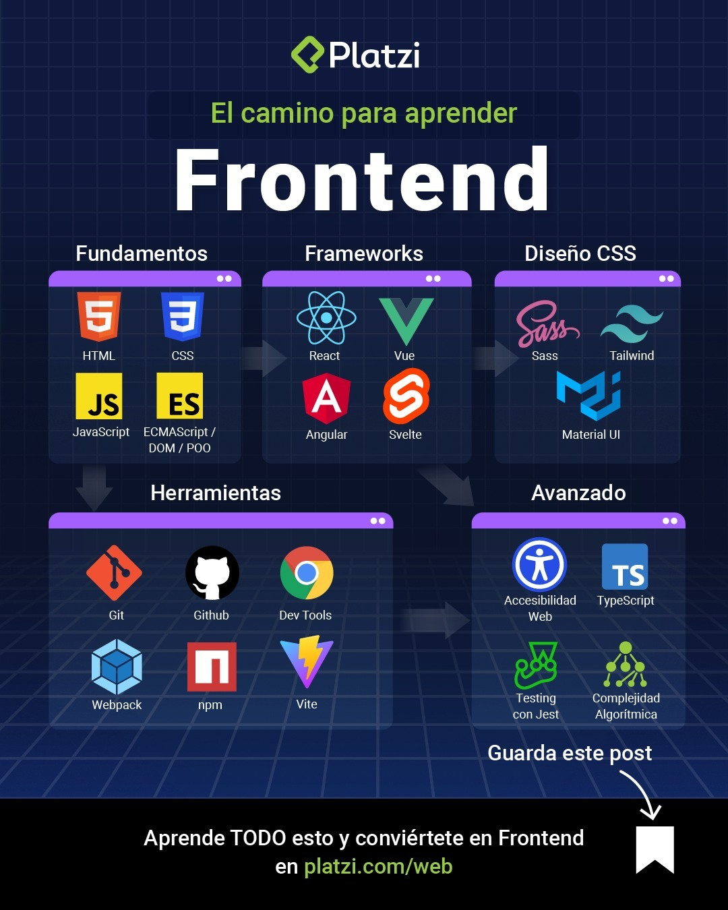

# Algorithms and Data Structures

Este repositorio contiene los ejercicios y proyectos realizados como parte del [FreeCodeCamp Algorithms and Data Structures course](https://www.freecodecamp.org/learn/javascript-algorithms-and-data-structures/).

## Descripción

El curso de Algoritmos y Estructuras de Datos está diseñado para enseñar los fundamentos de las estructuras de datos y algoritmos, así como su implementación en JavaScript.

En este curso aprenderás sobre los siguientes temas:

- Estructuras de datos básicos como arreglos, objetos y listas enlazadas.
- Algoritmos de búsqueda y clasificación, como búsqueda lineal, búsqueda binaria, clasificación de burbuja, clasificación de selección y clasificación de inserción.
- Estructuras de datos avanzadas como árboles binarios, gráficos y tablas hash.
- Búsqueda en profundidad, búsqueda en amplitud y algoritmos de recorrido de gráfico.
- Programación dinámica y algoritmos de recursión.

Además, aprenderá cómo aplicar estos conceptos para resolver problemas de programación del mundo real y mejorar sus habilidades de resolución de problemas algorítmicos.

Este curso es ideal para quienes buscan mejorar sus habilidades de programación en JavaScript, así como para quienes se preparan para programar entrevistas de trabajo u otros cursos avanzados de informática.

# Ruta

