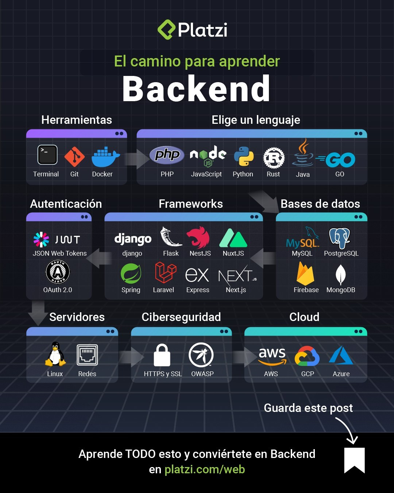
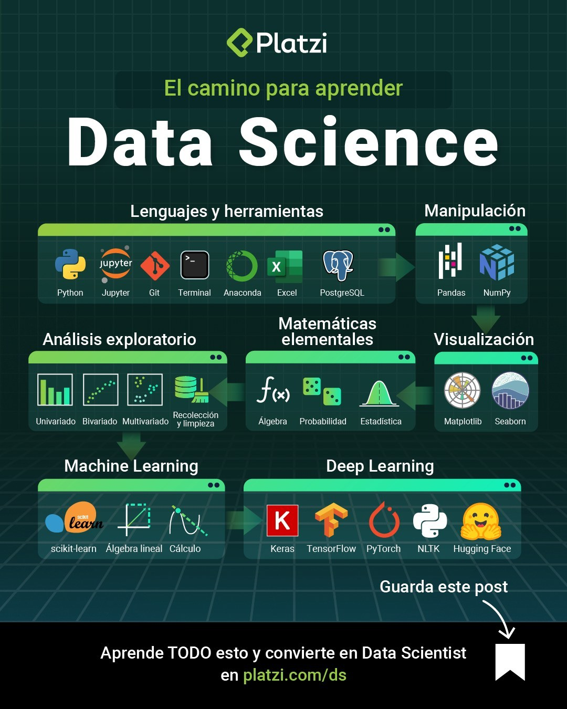
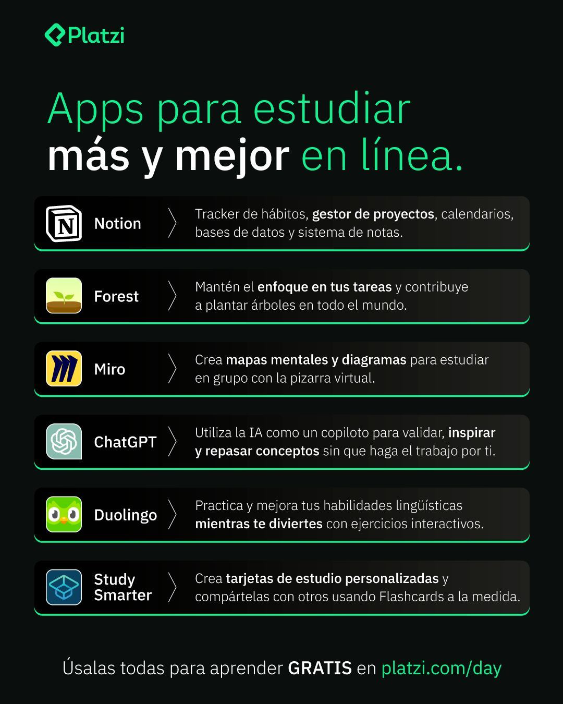

# Qué es "Road to Hero" en la programación?

"Road to Hero" es un término utilizado en la comunidad de programación para describir el proceso de aprendizaje y mejora constante en la programación.

Este camino incluye el aprendizaje de los conceptos básicos de la programación, como la sintaxis y la estructura de los lenguajes de programación, así como la resolución de problemas, el diseño de algoritmos y la implementación de soluciones eficientes.

Para convertirse en un "héroe" en la programación, es necesario dedicar tiempo y esfuerzo constantes a aprender y mejorar las habilidades. Esto incluye practicar la resolución de problemas e implementar proyectos de programación, así como aprender nuevas tecnologías y lenguajes de programación.

En resumen, el “Road to Hero” en programación es un proceso de aprendizaje continuo y mejora constante, que permite a los programadores adquirir habilidades y conocimientos para crear soluciones cada vez más avanzadas y eficientes en el mundo de la programación.

---

# FreeCodeCamp

[FreeCodeCamp](https://www.freecodecamp.org/learn) es una plataforma de aprendizaje en línea gratuita que ofrece una amplia variedad de cursos y proyectos de programación, desde desarrollo web hasta ciencia de datos y más.
## Descripción

FreeCodeCamp ofrece una amplia gama de cursos que le permiten aprender:

- Desarrollo web: HTML, CSS, JavaScript, React, Node.js y más.
- Desarrollo de aplicaciones móviles: Android e iOS.
- Ciencia de datos: Python, SQL, análisis de datos, aprendizaje automático y más.
- Desarrollo de juegos: Unity, C# y más.
- Habilidades de codificación y pensamiento crítico: algoritmos, estructuras de datos y más.

Además de los cursos, FreeCodeCamp también ofrece proyectos prácticos que le permiten aplicar sus habilidades recién adquiridas y construir una cartera sólida. También hay una comunidad de aprendizaje en línea donde puede hacer preguntas, recibir comentarios y conectarse con otros estudiantes y mentores.

En general, FreeCodeCamp es una excelente opción para quienes desean aprender a codificar y desarrollar habilidades de TI de forma gratuita y en línea.

## Rutas

# Herramientas de estudio

